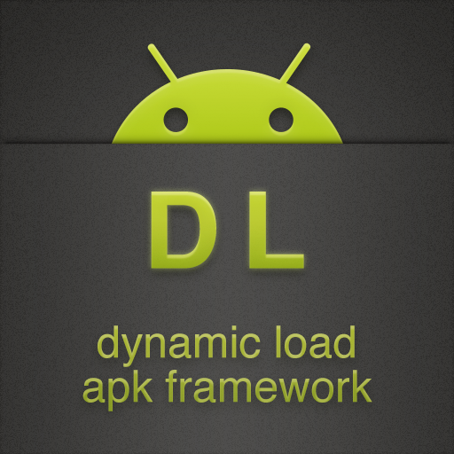
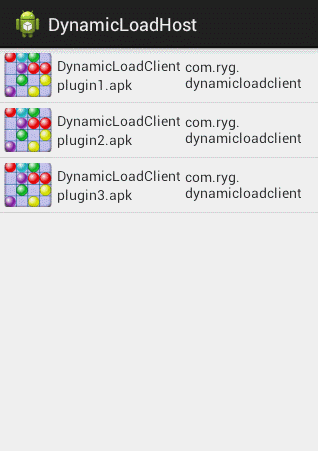

DL : dynamic load framework for android
================


support load apk which is not installed.

host : host apk, a container contains many plugin apks

plugin : plugin apk, which is invoked by host, also, it can be running when installed.

## about DL
1. plugin can be invoked by host without being installed
2. plugin can visit resources by R identifer
3. support Activity and FragmentActivity
4. nearly no reflection
5. plugin can be running when installed
6. provide threes development mode:
   (1) plugin not refer host
   (2) plugin partly refer host
   (3) plugin fully refer host
7. easy getting start, just need dl-lib.jar
8. support android 2.x

### resource managment
```java
protected void loadResources() {
    try {
        AssetManager assetManager = AssetManager.class.newInstance();
        Method addAssetPath = assetManager.getClass().getMethod("addAssetPath", String.class);
        addAssetPath.invoke(assetManager, mDexPath);
        mAssetManager = assetManager;
    } catch (Exception e) {
        e.printStackTrace();
    }
    Resources superRes = super.getResources();
    mResources = new Resources(mAssetManager, superRes.getDisplayMetrics(),
            superRes.getConfiguration());
    mTheme = mResources.newTheme();
    mTheme.setTo(super.getTheme());
}
```
then, in plugin project, resources can be visited by R identifer.
### activity lifecircle managment
```java
public interface DLPlugin {

    public void onStart();
    public void onRestart();
    public void onActivityResult(int requestCode, int resultCode, Intent data);
    public void onResume();
    public void onPause();
    public void onStop();
    public void onDestroy();
    public void onCreate(Bundle savedInstanceState);
    public void setProxy(Activity proxyActivity, String dexPath);
    public void onSaveInstanceState(Bundle outState);
    public void onNewIntent(Intent intent);
    public void onRestoreInstanceState(Bundle savedInstanceState);
    public boolean onTouchEvent(MotionEvent event);
    public boolean onKeyUp(int keyCode, KeyEvent event);
    public void onWindowAttributesChanged(LayoutParams params);
    public void onWindowFocusChanged(boolean hasFocus);
    public void onBackPressed();
    ...
}
```
implement DLPlugin in DLProxyActivity
```java
...
    @Override
    protected void onStart() {
        mRemoteActivity.onStart();
        super.onStart();
    }

    @Override
    protected void onRestart() {
        mRemoteActivity.onRestart();
        super.onRestart();
    }

    @Override
    protected void onResume() {
        mRemoteActivity.onResume();
        super.onResume();
    }

    @Override
    protected void onPause() {
        mRemoteActivity.onPause();
        super.onPause();
    }

    @Override
    protected void onStop() {
        mRemoteActivity.onStop();
        super.onStop();
    }
...
```
## How to develop a DL plugin
1. import dl-lib.jar
2. the key word this is dangerous
3. use that to instead this when visit Activity's methods
4. use startActivityByProxy and startActivityForResultByProxy to start activity, another, launchmode is not supported
5. not support service,broadcast can only be used by register it in code.

## Current job
1. DLIntent
2. UI Bus
3. some little android feature

## Demo


firstly, host will load all plugin apks located in /mnt/sdcard/DynamicLoadHost, then, plugin can be invoked by clicking list's item. Details can be found in source code.
### Thanks [nealgao](http://nealgao06.lofter.com) to design the logo for DL.
## License

    Copyright (C) 2014 singwhatiwanna(任玉刚) <singwhatiwanna@gmail.com>

    collaborator:田啸,宋思宇

    Licensed under the Apache License, Version 2.0 (the "License");
    you may not use this file except in compliance with the License.
    You may obtain a copy of the License at

         http://www.apache.org/licenses/LICENSE-2.0

    Unless required by applicable law or agreed to in writing, software
    distributed under the License is distributed on an "AS IS" BASIS,
    WITHOUT WARRANTIES OR CONDITIONS OF ANY KIND, either express or implied.
    See the License for the specific language governing permissions and
    limitations under the License.
